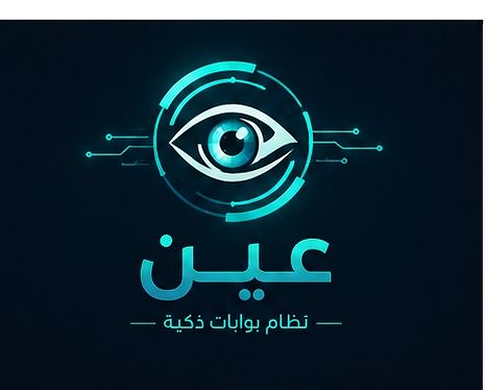

# عين — Smart Security Gate
### Face Recognition & Saudi License-Plate Recognition (LPR)

*Graduation Project — AI Program*

---

An AI-powered security gate. A driver arrives in a vehicle; a single camera frame
captures **the driver's face and the car's plate at the same moment**, and the system
makes **one access decision** while logging the vehicle electronically — replacing slow,
manual, error-prone checks.

> **Design principle:** the *face* is the access decision; the *license plate* is
> contextual logging (a person may change vehicles, so the plate is recorded but never
> required for entry).

---

## ✨ Features
- **Smart Gate (main mode)** — one image of *car + driver* → the system recognizes the
  face **and** reads the plate together → instant entry decision. Works from an
  **uploaded image** or a **live camera**, and shows the captured image with a clean
  result card: name, national ID, nationality, rank, and the plate in Arabic + English.
- **Facial recognition** (InsightFace) — authorize personnel by identity, with
  liveness / anti-spoofing.
- **Saudi LPR** — YOLOv8 plate detection + a trained character model reading both
  **Arabic** and **English** rows (digits + 17 letter classes, 27 classes total).
- **Automated access control** — gate opens only for an authorized identity
  (runs on a Raspberry Pi at the edge).
- **Electronic records** — timestamped entry/exit logs (KSA, UTC+3) and CSV export
  for a full audit trail.
- **Web dashboard** (Flask) — smart gate, live cameras, face analysis, plate reading,
  person management, and reports.

## 🧱 Tech Stack
| Component | Technology |
|---|---|
| Plate detection + character recognition | Ultralytics **YOLOv8** |
| Face recognition | **InsightFace** (buffalo_l) |
| Backup / hybrid OCR | **EasyOCR** |
| Backend & dashboard | **Flask** (Python) |
| Runtime | **Google Colab** (GPU) |
| Physical gate | **Raspberry Pi** (servo / relay) |

## 📁 Files
| File | Purpose |
|---|---|
| `FACE_LPR_Gate_Final.ipynb` | **Main notebook** — the combined Smart Gate (face + plate) system |
| `FACE_LPR_Final.ipynb` | Previous notebook (separate face / plate tools) |
| `Face_Dataset_Generator.ipynb` | Generates synthetic faces for enrollment |
| `Smart_Gate_Final.ipynb` | Legacy notebook (backup / fallback) |

> **Note:** the trained model `plate_chars.pt` and the face dataset are **not** stored in
> this repository (they are large and are loaded from Google Drive at runtime). See below.

---

## 🚀 How to Run (Google Colab)
The trained model is already saved on Google Drive, so **no training is needed** to run.

1. Open **`FACE_LPR_Gate_Final.ipynb`** in Colab (use the **Open in Colab** badge above) →
   **Runtime → Change runtime type → GPU**.
2. **① Setup** — run every cell (installs dependencies, writes the app files).
3. **② Load model from Drive** — fetches `plate_chars.pt`.
4. **③ Faces + names** *(optional)* — upload the face dataset and `employees.csv`
   *before* running, only if you want face recognition.
5. **④ Run** — pick the reading engine → run **🚀** → wait 4–6 min → run **🩺** to get
   the public link → open it.
6. On the site, open **🚪 Smart Gate** → upload a car+driver photo *or* use the live
   camera → get the access decision instantly.

> 💡 Run **section by section**, not all at once — the server needs a few minutes to
> load before testing.

## 🎛️ LPR Reading Engines
Set `PRIMARY_ENGINE` in the **🎛️** cell (Section ④), then re-run **🚀**:

| Engine | Behavior |
|---|---|
| `chars` *(default)* | Trained model reads everything (digits **and** letters) |
| `hybrid` | Digits from the trained model + letters from EasyOCR |
| `easyocr` | EasyOCR only (fallback) |

## 📊 Model Performance
- Plate **detection** ≈ **95%**.
- **Digit** reading ≈ **97%** (near-perfect on clear plates).
- **Letter** reading ≈ **92%** on clear, frontal, well-lit plates.
- Face recognition threshold: cosine **0.55**.

---

## 🔁 Training (summary)
- Character dataset: Saudi license-plate characters (27 classes) + synthetic
  augmentation via real-patch recombination.
- Base model: `yolov8s.pt`, trained from scratch on Colab.
- Output `plate_chars.pt` is saved to **Google Drive** and downloaded to the local
  machine. (Not committed here — load it from Drive at runtime.)

## 👥 Authors
- Saleh Abdullah Alshebil
- Alwaleed Abdulhafeedh Alsulami
- Sultan Saleh Alnashri

**Supervisor:** Dr. Badr Alsubaihi
